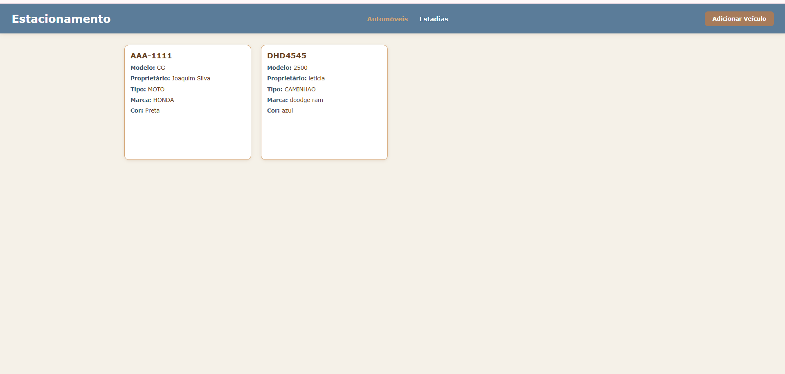
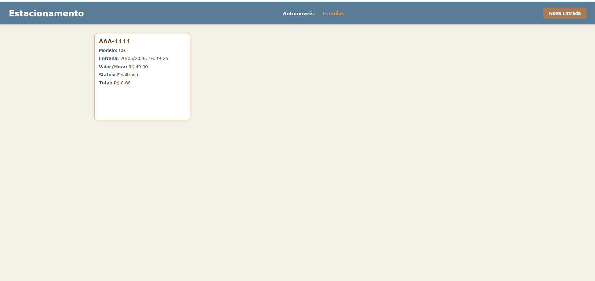
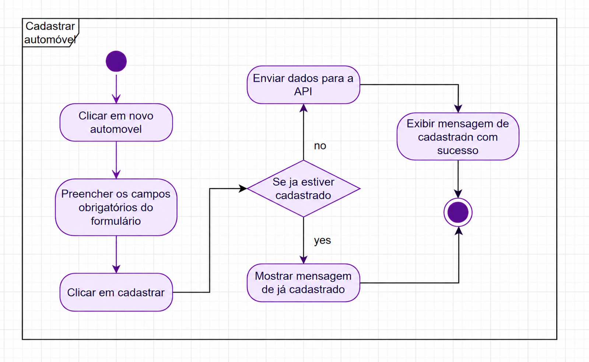
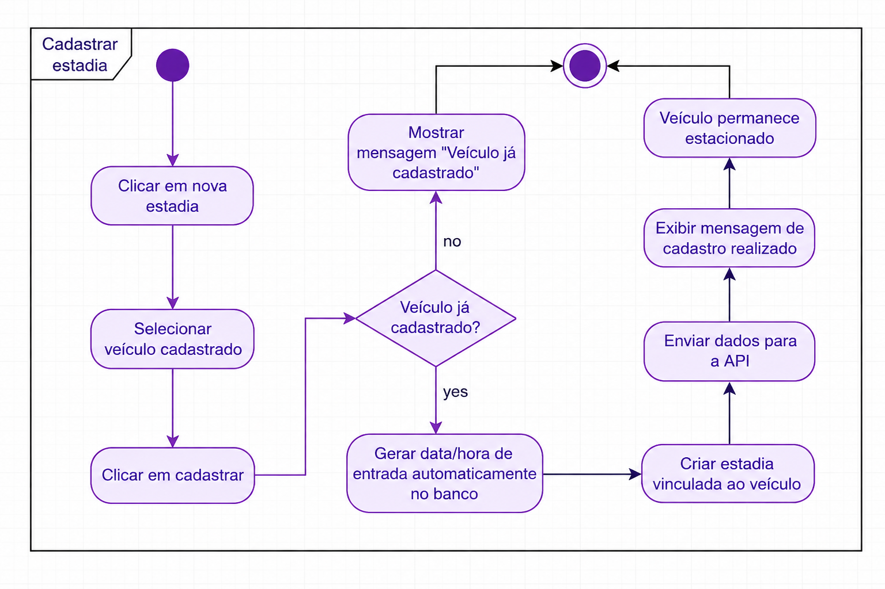
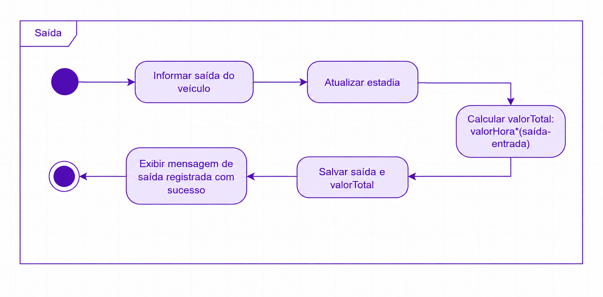
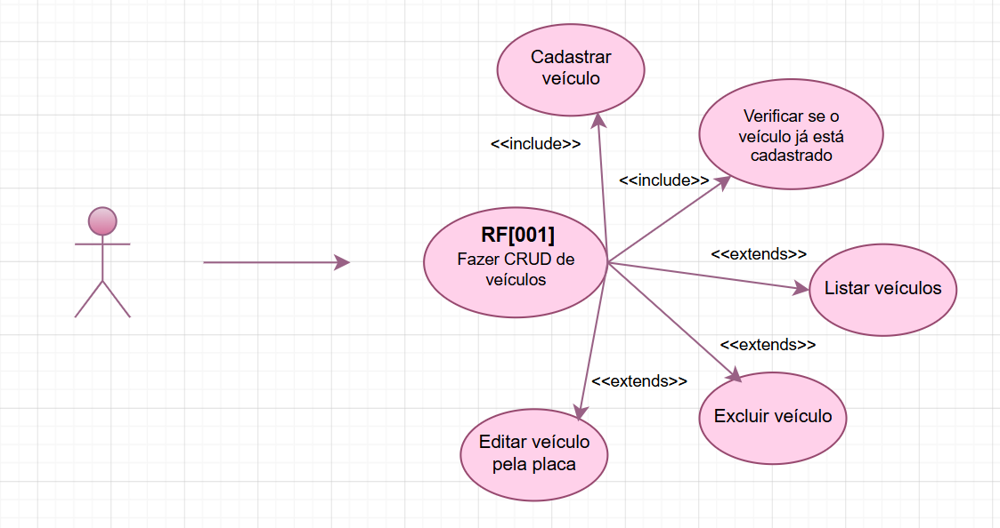
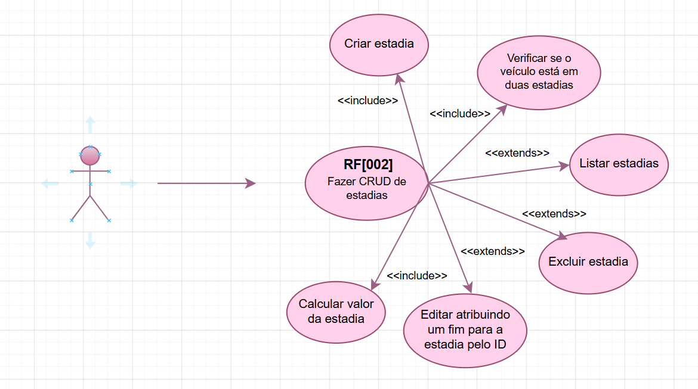

# Estacionamento - Sistema de Gestão

## Descrição do projeto
Sistema fullstack para controle de fluxo de veículos em estacionamentos. Permite o cadastro detalhado de frotas e o monitoramento de tempo de permanência com cálculo automático de valores. Feito para utilização pelo atendente via interface web.

## Print das Telas
|||
|:-:|:-:|
|Tela Inicial|Cadastro|

## Documentos - Diagramas de Casos de Uso
||||
|:-:|:-:|:-:|
|Caso de Uso Automóvel|Caso de Uso Estadias|Caso de Uso Saídas|

## Documentos - Diagramas de Atividades
|||
|:-:|:-:|
|Atividade Veículos|Atividade Estadias|

## Tecnologias

**Back-end:**
- Node.js
- Express
- Prisma ORM
- MySQL
- Cors
- Dotenv

**Front-end:**
- HTML5
- CSS3
- JavaScript

**Aplicativos utilizados:**
- VS Code
- XAMPP / MySQL Workbench
- Navegador de sua preferência
- Node.js + npm

## Passo a passo de como executar

### Back-end
1. Clone o repositório: `git clone + url do repositório`
2. Abra a pasta do projeto no terminal: `cd api`
3. Instale as dependências: `npm install`
4. Crie um arquivo `.env` na raiz com:
```env
PORT=3000
DATABASE_URL="mysql://root@localhost:3306/estacionamento"